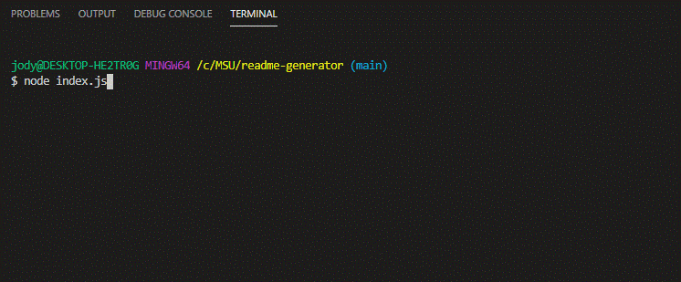
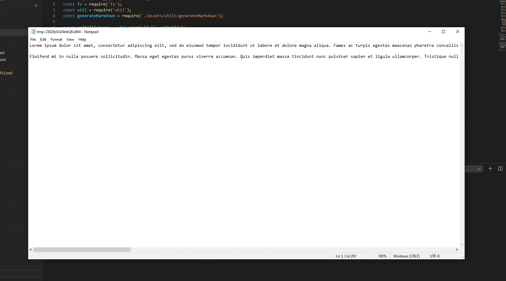
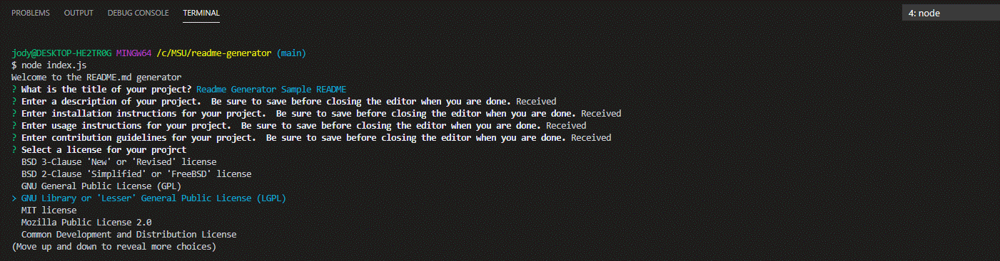
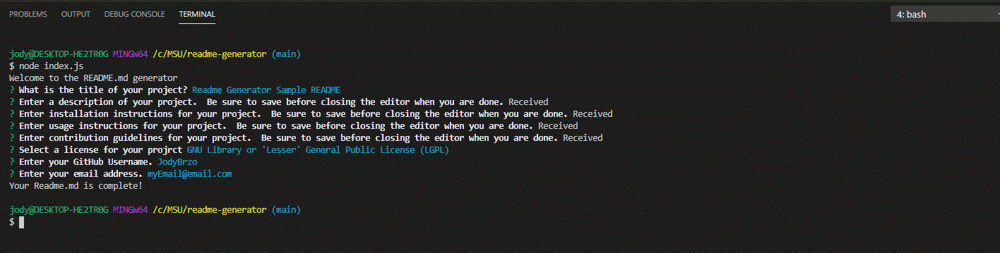

# Readme Generator
 Quickly and easily generate a README file using a command-line application.

 ## Technologies used
 JavaScript, Node.js, NPM, Inquirer.js

 ## Description
This professional README generator app uses Inquirer.js so that you can quickly and easily answer the command-line prompts dynamically generate a README file. Here is an example of a sample README https://github.com/JodyBrzo/readme-generator/blob/main/README-SAMPLE.md

## Usage
Check out my video _______ tutorial here or follow the steps below.

1. To run this program, using a terminal window, change directory to where the index.js file is stored.  
    At the command prompt type node index.js 

    

2. You will be asked to enter a title for your README. Once you enter in your title then press enter

3. The next question will ask you to enter in a description for your project.  Before typing press enter to launch your default text editor.  
    Here you can enter in multi paragraph description.  When you are finished typing be sure to save your file before closing.

    

4. Repeat step 3 for instillation instructions, usage instructions and contributions.

5. Next you are asked to select your preferred license.  Use the up and down arrows to make your selection and press enter.

    

6. Finally you are prompted to enter in your GitHub username and your email where future users can contact you for questions.

    

## What I learned
Making this app was a lot of fun!  I learned about the Node.js runtime environment, about NPM and how to install different libraries that are offered like Inquirer.js. I also enjoyed working with different .js files to build out the different functions.
